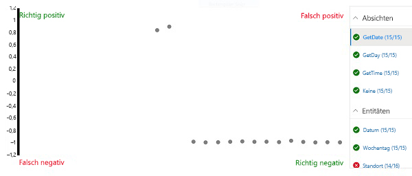

---
lab:
  title: Erstellen einer Language Understanding-App
  module: Module 5 - Creating Language Understanding Solutions
ms.openlocfilehash: d8a32a2b6404e81d8a5d69cef874fad209de1bfc
ms.sourcegitcommit: d6da3bcb25d1cff0edacd759e75b7608a4694f03
ms.translationtype: HT
ms.contentlocale: de-DE
ms.lasthandoff: 11/16/2021
ms.locfileid: "132625870"
---
# <a name="create-a-language-understanding-app"></a>Erstellen einer Language Understanding-App

Mit dem Language Understanding-Dienst können Sie eine App definieren, die ein Sprachmodell kapselt, mit dem Anwendungen Benutzereingaben in natürlicher Sprache interpretieren, die *Absicht* des Benutzers vorhersagen (was sie erreichen möchten) und alle *Entitäten* identifizieren können, auf die die Absicht angewendet werden soll.

Beispielsweise kann erwartet werden, dass eine Language Understanding-App für eine Uhranwendung Eingaben wie die folgenden verarbeitet:

*Wie spät ist es in London?*

Diese Art von Eingabe ist ein Beispiel für eine *Äußerung* (etwas, das ein Benutzer sagen oder eingeben kann), deren gewünschte *Absicht* es ist, die Zeit an einem bestimmten Ort (einer *Entität*) zu erfahren, in diesem Fall London.

> **Hinweis**: Die Aufgabe der Language Understanding-App besteht darin, die Absicht des Benutzers vorherzusagen und alle Entitäten zu identifizieren, für die die Absicht gilt. Es ist <u>nicht</u> ihre Aufgabe, die Aktionen tatsächlich durchzuführen, die erforderlich sind, um die Absicht zu erfüllen. Beispielsweise kann die Uhranwendung eine Sprach-App verwenden, um zu erkennen, dass der Benutzer die Uhrzeit in London erfahren möchte. Aber die Clientanwendung selbst muss dann die Logik implementieren, um die richtige Zeit zu bestimmen und dem Benutzer zu präsentieren.

## <a name="clone-the-repository-for-this-course"></a>Klonen des Repositorys für diesen Kurs

Wenn Sie das Coderepository **AI-102-AIEngineer** noch nicht in die Umgebung geklont haben, in der Sie an diesem Lab arbeiten werden, führen Sie die folgenden Schritte aus, um dies zu tun. Öffnen Sie andernfalls den geklonten Ordner in Visual Studio Code.

1. Starten Sie Visual Studio Code.
2. Öffnen Sie die Palette (UMSCHALT+STRG+P), und führen Sie einen **Git: Clone**-Befehl aus, um das Repository `https://github.com/MicrosoftLearning/AI-102-AIEngineer` in einen lokalen Ordner zu klonen (der Ordner ist beliebig).
3. Nachdem das Repository geklont wurde, öffnen Sie den Ordner in Visual Studio Code.
4. Warten Sie, während zusätzliche Dateien zur Unterstützung der C#-Codeprojekte im Repository installiert werden.

    > **Hinweis**: Wenn Sie aufgefordert werden, erforderliche Ressourcen zum Erstellen und Debuggen hinzuzufügen, wählen Sie **Not now** (Jetzt nicht) aus.

## <a name="create-language-understanding-resources"></a>Erstellen von Language Understanding-Ressourcen

Um den Dienst „Language Understanding“ verwenden zu können, benötigen Sie zwei Arten von Ressourcen:

- Eine *Erstellungs* ressource, mit der Sie die Language Understanding-App definieren, trainieren und testen. Diese Ressource muss als **Language Understanding – Erstellung**-Ressource in Ihrem Azure-Abonnement erstellt werden.
- Eine *Vorhersage* ressource, mit der Sie Ihre Language Understanding-App veröffentlichen und Anforderungen von Clientanwendungen verarbeiten, die diese verwenden. Diese Ressource muss entweder als **Language Understanding**- oder als **Cognitive Services**-Ressource in Ihrem Azure-Abonnement erstellt werden.

     > **Wichtig**: Erstellungsressourcen müssen in einer von drei *Regionen* erstellt werden (Europa, Australien oder USA). Language Understanding-Apps, die in europäischen oder australischen Erstellungsressourcen erstellt wurden, können nur in Vorhersageressourcen in Europa bzw. in Australien bereitgestellt werden. Modelle, die in US-Erstellungsressourcen erstellt wurden, können in Vorhersageressourcen in beliebigen Azure-Standorten bereitgestellt werden, mit Ausnahme von Europa und Australien. Weitere Details zu kompatiblen Erstellungs- und Veröffentlichungsstandorten finden Sie in der [Dokumentation zu Erstellungs- und Veröffentlichungsregionen](https://docs.microsoft.com/azure/cognitive-services/luis/luis-reference-regions).

Wenn Sie noch nicht über Language Understanding-Erstellungs- und Vorhersageressourcen verfügen:

1. Öffnen Sie das Azure-Portal unter `https://portal.azure.com`, und melden Sie sich mit dem Microsoft-Konto an, das Ihrem Azure-Abonnement zugeordnet ist.
2. Wählen Sie die Schaltfläche **&#65291;Ressource erstellen** aus, suchen Sie nach *Language Understanding*, und erstellen Sie eine **Language Understanding**-Ressource mit den folgenden Einstellungen.

    *Stellen Sie sicher, dass Sie **Language Understanding** und <u>nicht</u> „Language Understanding (Azure Cognitive Services)“ auswählen.*

    - **Option „Erstellen“**: Beides
    - **Abonnement:** *Geben Sie Ihr Azure-Abonnement an.*
    - **Ressourcengruppe**: *Wählen Sie eine Ressourcengruppe aus, oder erstellen Sie eine Ressourcengruppe (wenn Sie eine gehostete Lab-Umgebung verwenden, sind Sie möglicherweise nicht berechtigt, eine neue Ressourcengruppe zu erstellen, verwenden Sie dann die bereitgestellte Ressourcengruppe).*
    - **Name**: *Geben Sie einen eindeutigen Namen ein.*
    - **Speicherort für Dokumenterstellung**: *Wählen Sie Ihren bevorzugten Speicherort aus.*
    - **Tarif für die Erstellung**: F0
    - **Vorhersagestandort**: *Identisch mit Ihrem Erstellungsstandort.*
    - **Tarif für Vorhersage**: F0
3. Warten Sie, bis die Ressourcen erstellt wurden, und beachten Sie, dass zwei Language Understanding-Ressourcen bereitgestellt werden, eine für die Dokumenterstellung und eine für die Vorhersage. Sie können beide anzeigen, indem Sie zu der Ressourcengruppe navigieren, in der Sie sie erstellt haben. Wenn Sie **Zu Ressource wechseln** auswählen, wird die *Erstellungs* ressource geöffnet.

## <a name="create-a-language-understanding-app"></a>Erstellen einer Language Understanding-App

Nachdem Sie nun eine Erstellungsressource erstellt haben, können Sie sie zum Erstellen einer Language Understanding-App verwenden.

1. Öffnen Sie auf einer neuen Browserregisterkarte das Language Understanding-Portal unter `https://www.luis.ai`.
2. Melden Sie sich mit Ihrem Microsoft-Konto an, das mit Ihrem Azure-Abonnement verknüpft ist. Wenn Sie sich zum ersten Mal beim Language Understanding-Portal anmelden, müssen Sie der App möglicherweise einige Berechtigungen für den Zugriff auf Ihre Kontodaten erteilen. Führen Sie dann die Schritte unter *Welcome* (Willkommen) aus, indem Sie Ihr Abonnement und die Erstellungsressource auswählen, die Sie gerade erstellt haben.

    > **Hinweis**: Wenn Ihr Konto mehreren Abonnements in unterschiedlichen Verzeichnissen zugeordnet ist, müssen Sie möglicherweise zu dem Verzeichnis wechseln, das das Abonnement enthält, in dem Sie Ihre Language Understanding-Ressourcen bereitgestellt haben.

3. Öffnen Sie die Seite **Unterhaltungs-Apps**, und stellen Sie sicher, dass Ihr Abonnement und Ihre Language Understanding-Erstellungsressource ausgewählt sind. Erstellen Sie anschließend eine neue Konversations-App mit den folgenden Einstellungen:
    - **Name**: Clock (Uhr)
    - **Kultur**: Deutsch (*Lassen Sie das Feld leer, falls diese Option nicht verfügbar ist.* )
    - **Beschreibung**: Uhr in natürlicher Sprache
    - **Vorhersageressource**: *Ihre Language Understanding-Vorhersageressource*.

    Wenn Ihre **Clock**-App nicht automatisch geöffnet wird, öffnen Sie sie.
    
    Wenn ein Fenster mit Tipps zur Erstellung einer effektiven Language Understanding-App angezeigt wird, schließen Sie es.

## <a name="create-intents"></a>Erstellen von Absichten

Als Erstes definieren wir in der neuen App einige Absichten.

1. Wählen Sie auf der Seite **Absichten** die Option **&#65291; Erstellen** aus, um eine neue Absicht namens **GetTime** zu erstellen.
2. Fügen Sie in der Absicht **GetTime** die folgenden Äußerungen als Beispielbenutzereingabe hinzu:

    *Wie spät ist es?*

    *Wie viel Uhr ist es?*

3. Nachdem Sie diese Äußerungen hinzugefügt haben, wechseln Sie zurück zur Seite **Absichten**, und fügen Sie eine weitere neue Absicht namens **GetDay** mit den folgenden Äußerungen hinzu:

    *Welcher Tag ist heute?*

    *Welchen Tag haben wir?*

4. Nachdem Sie diese Äußerungen hinzugefügt haben, wechseln Sie zurück zur Seite **Absichten**, und fügen Sie eine weitere neue Absicht namens **GetDate** mit den folgenden Äußerungen hinzu:

    *Welches Datum haben wir heute?*

    *Welches Datum ist heute?*

5. Nachdem Sie diese Äußerungen hinzugefügt haben, wechseln Sie zurück zur Seite **Absichten**, und wählen Sie die Absicht **None** (Keine) aus. Diese wird als Fallback für Eingaben bereitgestellt, die keinen Absichten zugeordnet werden können, die Sie in Ihrem Sprachmodell definiert haben.
6. Fügen Sie der Absicht **None** (Keine) die folgenden Äußerungen hinzu:

    *hello*

    *Auf Wiedersehen*

## <a name="train-and-test-the-app"></a>Schulen und Testen der App

Nachdem Sie nun einige Absichten hinzugefügt haben, trainieren wir die App und sehen, ob sie sie aus Benutzereingaben richtig vorhersagen kann.

1. Wählen Sie rechts oben im Portal den Befehl **Trainieren** aus, um die App zu trainieren.
2. Nachdem die App trainiert wurde, wählen Sie **Testen** aus, um den Bereich „Testen“ anzuzeigen, und geben Sie dann die folgende Testäußerung ein:

    *Wie viel Uhr ist es jetzt?*

    Überprüfen Sie das zurückgegebene Ergebnis, und achten Sie darauf, dass es die vorhergesagte Absicht (bei der es sich um **GetTime** handeln sollte) und eine Zuverlässigkeitsbewertung enthält, die die Wahrscheinlichkeit angibt, die das Modell für die vorhergesagte Absicht berechnet hat.

3. Probieren Sie die folgende Testäußerung aus:

    *Sag mir die Uhrzeit*

    Überprüfen Sie erneut die vorhergesagte Absicht und die Zuverlässigkeitsbewertung.

4. Probieren Sie die folgende Testäußerung aus:

    *Was ist heute?*

    Hoffentlich sagt das Modell die **GetDay**-Absicht vorher.

5. Probieren Sie abschließend diese Testäußerung aus:

    *Hallo*

    Daraufhin sollte die Absicht **None** (Keine) zurückgegeben werden.

6. Schließen Sie das Testpanel.

## <a name="add-entities"></a>Hinzufügen von Entitäten

Bisher haben Sie ein paar Beispieläußerungen definiert, die sich Absichten zuordnen lassen. Die meisten realen Anwendungen enthalten komplexere Äußerungen, aus denen bestimmte Datenentitäten extrahiert werden müssen, um mehr Kontext für die Absicht zu erhalten.

### <a name="add-a-machine-learned-entity"></a>Hinzufügen einer *durch maschinelles Lernen erworbenen* Entität

Die häufigste Art von Entität ist eine *durch maschinelles Lernen erworbene* Entität, bei der die App lernt, Entitätswerte anhand von Beispielen zu identifizieren.

1. Wählen Sie auf der Seite **Entitäten** die Option **&#65291; Erstellen** aus, um eine neue Entität zu erstellen.
2. Erstellen Sie im Dialogfeld **Entität erstellen** eine **maschinell erlernte** Entität namens **Location** (Ort).
3. Kehren Sie nach dem Erstellen der Entität **Location** (Ort) zur Seite **Absichten** zurück, und wählen Sie die Absicht **GetTime** aus.
4. Geben Sie die folgende neue Beispieläußerung ein:

    *Wie spät ist es in London?*

5. Wenn die Äußerung hinzugefügt wurde, wählen Sie das Wort ***london** _ aus, und wählen Sie dann in der angezeigten Dropdownliste _ *Location** (Ort) aus, um anzugeben, dass „london“ ein Beispiel für einen Standort ist.
6. Fügen Sie eine weitere Beispieläußerung hinzu:

    *Wie ist die aktuelle Uhrzeit in New York?*

7. Nachdem die Äußerung hinzugefügt wurde, wählen Sie die Wörter ***new york** _ aus, und ordnen Sie sie der Entität _ *Location** (Ort) zu.

### <a name="add-a-list-entity"></a>Hinzufügen einer *list*-Entität (Liste)

In einigen Fällen können gültige Werte für eine Entität auf eine Liste mit bestimmten Begriffen und Synonymen beschränkt werden. Dies kann der App helfen, Instanzen der Entität in Äußerungen zu identifizieren.

1. Wählen Sie auf der Seite **Entitäten** die Option **&#65291; Erstellen** aus, um eine neue Entität zu erstellen.
2. Erstellen Sie im Dialogfeld **Entität erstellen** eine **maschinell erlernte** Liste namens **Weekday** (Wochentag).
3. Fügen Sie die folgenden **normalisierten Werte** und **Synonyme** hinzu:

    | Normalisierte Werte | Synonyme|
    |-------------------|---------|
    | sunday | sun |
    | monday | mon |
    | tuesday | tue |
    | wednesday | wed |
    | thursday | thu |
    | friday | fri |
    | saturday | sat |

3. Kehren Sie nach dem Erstellen der Entität **Weekday** (Wochentag) zur Seite **Absichten** zurück, und wählen Sie die Absicht **GetDate** aus.
4. Geben Sie die folgende neue Beispieläußerung ein:

    *Welches Datum war am Samstag?*

5. Nachdem die Äußerung hinzugefügt wurde, überprüfen Sie, ob **saturday** (Samstag) automatisch der Entität **Weekday** (Wochentag) zugeordnet wurde. Wenn dies nicht der Fall ist, wählen Sie das Wort **_saturday_ *_ aus, und wählen Sie in der angezeigten Dropdownliste _* Weekday** aus.
6. Fügen Sie eine weitere Beispieläußerung hinzu:

    *Welches Datum haben wir am Freitag?*

7. Nachdem die Äußerung hinzugefügt wurde, stellen Sie sicher, dass **friday** der Entität **Weekday** zugeordnet ist.

### <a name="add-a-regex-entity"></a>Hinzufügen einer *Regex*-Entität (regulärer Ausdruck)

Manchmal haben Entitäten ein bestimmtes Format, z. B. eine Seriennummer, einen Formularcode oder ein Datum. Sie können einen regulären Ausdruck (*regex*) definieren, der ein erwartetes Format beschreibt, um Ihrer App beim Identifizieren übereinstimmender Entitätswerte zu helfen.

1. Wählen Sie auf der Seite **Entitäten** die Option **&#65291; Erstellen** aus, um eine neue Entität zu erstellen.
2. Erstellen Sie im Dialogfeld **Entität erstellen** eine **Regex**-Entität namens **Date** (Datum) mit dem folgenden regulären Ausdruck:

    ```
    [0-9]{2}/[0-9]{2}/[0-9]{4}
    ```

    > **Hinweis**: Dies ist ein einfacher regulärer Ausdruck, der nach zwei Ziffern sucht, gefolgt von einem „/“, weiteren zwei Ziffern, einem weiteren „/“ und vier Ziffern, z. B. *01/11/2020*. Er lässt ungültige Datumsangaben zu, z. B. *56/00/9999*, doch es ist wichtig zu beachten, dass die Entität „regex“ verwendet wird, um Dateneingaben zu identifizieren, die als Datum *gedacht* sind, und nicht, um Datumswerte zu überprüfen.

3. Kehren Sie nach dem Erstellen der Entität **Date** (Datum) zur Seite **Absichten** zurück, und wählen Sie die Absicht **GetDay** aus.
4. Geben Sie die folgende neue Beispieläußerung ein:

    *Welcher Tag war der 01.01.1901?*

5. Nachdem die Äußerung hinzugefügt wurde, überprüfen Sie, ob **01/01/1901** automatisch der Entität **Date** (Datum) zugeordnet wurde. Wenn dies nicht der Fall ist, wählen Sie **_01/01/1901_ *_ aus, und wählen Sie in der angezeigten Dropdownliste _* Date** (Datum) aus.
6. Fügen Sie eine weitere Beispieläußerung hinzu:

    *Welchen Tag haben wir am 12.12.2099?*

7. Nachdem die Äußerung hinzugefügt wurde, stellen Sie sicher, dass **12/12/2099** der Entität **Date** zugeordnet ist.

### <a name="retrain-the-app"></a>Erneutes Trainieren der App

Nachdem Sie das Sprachmodell geändert haben, müssen Sie die App erneut trainieren und testen.

1. Wählen Sie rechts oben im Portal den Befehl **Trainieren** aus, um die App erneut zu trainieren.
2. Nachdem die App trainiert wurde, wählen Sie **Testen** aus, um den Bereich „Testen“ anzuzeigen, und geben Sie dann die folgende Testäußerung ein:

    *Wie viel Uhr ist es in Edinburgh?*

3. Überprüfen Sie das zurückgegebene Ergebnis, das hoffentlich die Absicht **GetTime** vorhersagt. Wählen Sie dann **Untersuchen** aus, und untersuchen Sie in dem angezeigten zusätzlichen Untersuchungsbereich den Abschnitt **ML-Entitäten**. Das Modell sollte vorhergesagt haben, dass „Edinburgh“ eine Instanz einer **Location**-Entität (Ort) ist.
4. Testen Sie die folgenden Äußerungen:

    *Welches Datum ist am Freitag?*

    *Welches Datum haben wir am Do?*

    *Welcher Tag war am 01.01.2020?*

5. Schließen Sie nach Abschluss der Tests den Untersuchungsbereich, aber lassen Sie den Testbereich geöffnet.

## <a name="perform-batch-testing"></a>Durchführen von Batchtests

Sie können den Testbereich verwenden, um einzelne Äußerungen interaktiv zu testen, aber für komplexere Sprachmodelle ist es im Allgemeinen effizienter, *Batchtests* durchzuführen.

1. Öffnen Sie in Visual Studio Code die Datei **batch-test.json** im Ordner **09-luis-app**. Diese Datei besteht aus einem JSON-Dokument, das mehrere Testfälle für das von Ihnen erstellte Clock-Sprachmodell (Uhr) enthält.
2. Wählen Sie im Language Understanding-Portal im Bereich „Testen“ die Option **Batchtestbereich** aus. Wählen Sie dann **&#65291; Importieren** aus, und importieren Sie die Datei **batch-test.json**, wobei Sie ihr den Namen **clock-test** zuweisen.
3. Führen Sie im Batchtestbereich den Test **clock-test** aus.
4. Nachdem der Test abgeschlossen wurde, wählen Sie **Ergebnisse anzeigen** aus.
5. Zeigen Sie auf der Ergebnisseite die Konfusionsmatrix an, die die Vorhersageergebnisse darstellt. Es werden wahr positive, falsch positive, wahr negative und falsch negative Vorhersagen für die Absicht oder Entität angezeigt, die in der Liste auf der rechten Seite ausgewählt ist.

    

    > **Hinweis**: Jede Äußerung wird für jede Absicht als *positiv* oder *negativ* bewertet, also sollte z. B. „Wie viel Uhr ist es?“ als *positiv* für die Absicht **GetTime** und als *negativ* für die Absicht **GetDate** bewertet werden. Die Punkte in der Konfusionsmatrix zeigen, welche Äußerungen richtig (*true*) und falsch (*false*) als *positiv* und *negativ* für die ausgewählte Absicht vorhergesagt wurden an.

6. Wählen Sie bei ausgewählter Absicht **GetDate** einen der Punkte in der Konfusionsmatrix aus, um die Details der Vorhersage anzuzeigen – einschließlich der Äußerung und des Zuverlässigkeitswerts für die Vorhersage. Wählen Sie dann die Absichten **GetDay**, **GetTime** und **None** aus, und zeigen Sie deren Vorhersageergebnisse an. Die App sollte bei der richtigen Vorhersage der Absichten gut abgeschnitten haben.

    > **Hinweis**: Möglicherweise löscht die Benutzeroberfläche zuvor ausgewählte Punkte nicht.

7. Wählen Sie die Entität **Location** (Ort) aus, und zeigen Sie die Vorhersageergebnisse in der Konfusionsmatrix an. Beachten Sie insbesondere die Vorhersagen, die *falsch negativ* waren. Diese waren Fälle, bei denen die App den in der Äußerung angegebenen Ort nicht erkennen konnte. Dies weist darauf hin, dass Sie möglicherweise weitere Beispieläußerungen für die Absichten hinzufügen und das Modell erneut trainieren müssen.
8. Schließen Sie den Batchtestbereich.

## <a name="publish-the-app"></a>Veröffentlichen der App

In einem echten Projekt würden Sie Absichten und Entitäten iterativ optimieren, erneut trainieren und erneut testen, bis Sie mit der Vorhersageleistung zufrieden sind. Anschließend können Sie die App für die Verwendung durch Clientanwendungen veröffentlichen.

1. Wählen Sie oben rechts im Language Understanding-Portal **Veröffentlichen** aus.
2. Wählen Sie **Produktionsslot** aus, und veröffentlichen Sie die App.
3. Wählen Sie nach Abschluss der Veröffentlichung oben im Language Understanding-Portal **Verwalten** aus.
4. Notieren Sie die **App-ID** von der Seite **Einstellungen**. Clientanwendungen benötigen dies, um Ihre App zu verwenden.
5. Notieren Sie von der Seite **Azure-Ressourcen** den **Primärschlüssel**, den **Sekundärschlüssel** und die **Endpunkt-URL** für die Vorhersageressource, über die die App genutzt werden kann. Clientanwendungen benötigen den Endpunkt und einen der Schlüssel, um eine Verbindung mit der Vorhersageressource herzustellen und authentifiziert zu werden.
6. Wählen Visual Studio Code im Ordner **09-luis-app** die Batchdatei **GetIntent.cmd** aus, und zeigen Sie den darin enthaltenen Code an. Dieses Befehlszeilenskript verwendet cURL zum Aufrufen der Language Understanding REST-API für die angegebene Anwendung und den angegebenen Vorhersageendpunkt.
7. Ersetzen Sie die Platzhalterwerte im Skript durch die **App-ID**, die **Endpunkt-URL** und entweder den **Primärschlüssel** oder den **Sekundärschlüssel** für Ihre Language Understanding-App, und speichern Sie dann die aktualisierte Datei.
8. Klicken Sie mit der rechten Maustaste auf den Ordner **09-luis-app**, und öffnen Sie ein integriertes Terminal. Geben Sie dann den folgenden Befehl ein (stellen Sie sicher, dass Sie die Anführungszeichen enthalten sind):

    ```
    GetIntent "What's the time?"
    ```

9. Überprüfen Sie die von Ihrer App zurückgegebene JSON-Antwort, die die Absicht mit der besten Bewertung angeben sollte, die für Ihre Eingabe vorhergesagt wurde (dies sollte **GetTime** sein).
10. Führen Sie den folgenden Befehl aus:

    ```
    GetIntent "What's today's date?"
    ```

11. Untersuchen Sie die Antwort, und vergewissern Sie sich, dass sie die Absicht **GetDate** vorhersagt.
12. Führen Sie den folgenden Befehl aus:

    ```
    GetIntent "What time is it in Sydney?"
    ```

13. Untersuchen Sie die Antwort, und vergewissern Sie sich, dass sie eine Entität **Location** enthält.

14. Probieren Sie die folgenden Befehle aus, und untersuchen Sie die Antworten:

    ```
    GetIntent "What time is it in Glasgow?"
    ```

    ```
    GetIntent "What's the time in Nairobi?"
    ```

    ```
    GetIntent "What's the UK time?"
    ```
15. Probieren Sie einige weitere Varianten aus. Ziel dabei ist es, mindestens ein paar Antworten zu generieren, die die Absicht **GetTime** richtig vorhersagen, aber keine **Location**-Entität erkennen.

    Lassen Sie das Terminal geöffnet. Sie kehren später hierhin zurück.

## <a name="apply-active-learning"></a>Anwenden des *aktiven Lernens*

Sie können eine Language Understanding-App auf Grundlage historischer Äußerungen verbessern, die an den Endpunkt übermittelt werden. Diese Vorgehensweise wird als *aktives Lernen* bezeichnet.

Im vorherigen Verfahren haben Sie cURL verwendet, um Anforderungen an den Endpunkt Ihrer App zu übermitteln. Diese Anforderungen enthielten die Option zum Protokollieren der Abfragen, wodurch die App in die Lage versetzt wurde, sie für die Verwendung beim aktiven Lernen nachzuverfolgen.

1. Wählen Sie im Language Understanding-Portal **Erstellen** aus, und zeigen Sie die Seite **Endpunktäußerungen überprüfen** an. Auf dieser Seite werden protokollierte Äußerungen aufgelistet, die der Dienst zur Überprüfung gekennzeichnet hat.
2. Wählen Sie für jede Äußerung, für die die Absicht und eine neue Location-Entität (die nicht in den ursprünglichen Trainingsäußerungen enthalten war) richtig vorhergesagt werden, **&#10003;** aus, um die Entität zu bestätigen, und verwenden Sie dann das Symbol **&#10514;** , um die Äußerung der Absicht als Trainingsbeispiel hinzuzufügen.
3. Suchen Sie nach einem Beispiel für eine Äußerung, bei der die **GetTime**-Absicht richtig identifiziert wurde, aber <u>keine</u> **Location**-Entität identifiziert wurde, wählen Sie den Location-Namen aus, und ordnen Sie ihn der **location**-Entität zu. Verwenden Sie dann das Symbol **&#10514;** , um die Äußerung der Absicht als Trainingsbeispiel hinzuzufügen.
4. Wechseln Sie zur Seite **Absichten**, und öffnen Sie die Absicht **GetTime**, um zu bestätigen, dass die vorgeschlagenen Äußerungen hinzugefügt wurden.
5. Wählen Sie oben im Language Understanding-Portal **Trainieren** aus, um die App erneut zu trainieren.
6. Wählen Sie oben rechts im Language Understanding-Portal **Veröffentlichen** aus, und veröffentlichen Sie die App im **Produktionsslot** erneut.
7. Kehren Sie zum Terminal für den Ordner **09-luis-app** zurück, und verwenden Sie den Befehl **GetIntent**, um die Äußerung zu übermitteln, die Sie während des aktiven Lernens hinzugefügt und korrigiert haben.
8. Vergewissern Sie sich, dass das Ergebnis jetzt die **Location**-Entität enthält. Probieren Sie dann eine andere Äußerung aus, die dieselbe Phrase verwendet, aber einen anderen Ort angibt (z. B. *Berlin*).

## <a name="export-the-app"></a>Exportieren der App

Sie können das Language Understanding-Portal verwenden, um Ihre Sprach-App zu entwickeln und zu testen, aber in einem Softwareentwicklungsprozess für DevOps sollten Sie eine quellengesteuerte Definition der App beibehalten, die in CI/CD-Pipelines (Continuous Integration/Continuous Delivery) aufgenommen werden kann. Sie *können* zwar das Language Understanding SDK oder die REST-API in Codeskripts verwenden, um die App zu erstellen und zu trainieren, doch eine einfachere Möglichkeit besteht darin, die App über das Portal zu erstellen und als *.lu*-Datei zu exportieren, die in eine andere Language Understanding-Instanz importiert und neu trainiert werden kann. Mit diesem Ansatz können Sie die Produktivitätsvorteile des Portals nutzen und gleichzeitig Portabilität und Reproduzierbarkeit für die App aufrechterhalten.

1. Wählen Sie im Language Understanding-Portal **Verwalten** aus.
2. Wählen Sie auf der Seite **Versionen** die aktuelle Version der App aus (es sollte nur eine vorhanden sein).
3. Wählen Sie in der Dropdownliste **Exportieren** die Option **Als LU exportieren** aus. Wenn Sie dann von Ihrem Browser dazu aufgefordert werden, speichern Sie die Datei im Ordner **09-luis-app**.
4. Öffnen Sie in Visual Studio Code die **.lu**-Datei, die Sie gerade exportiert und heruntergeladen haben (wenn Sie aufgefordert werden, den Marketplace nach einer Erweiterung zu durchsuchen, die sie lesen kann, schließen Sie die Aufforderung). Beachten Sie, dass das LU-Format für Menschen lesbar ist, sodass es eine effektive Möglichkeit bietet, die Definition Ihrer Language Understanding-App in einer Teamentwicklungsumgebung zu dokumentieren.

## <a name="more-information"></a>Weitere Informationen

Weitere Informationen zur Verwendung des **Language Understanding**-Diensts finden Sie in der [Language Understanding-Dokumentation](https://docs.microsoft.com/azure/cognitive-services/luis/).
