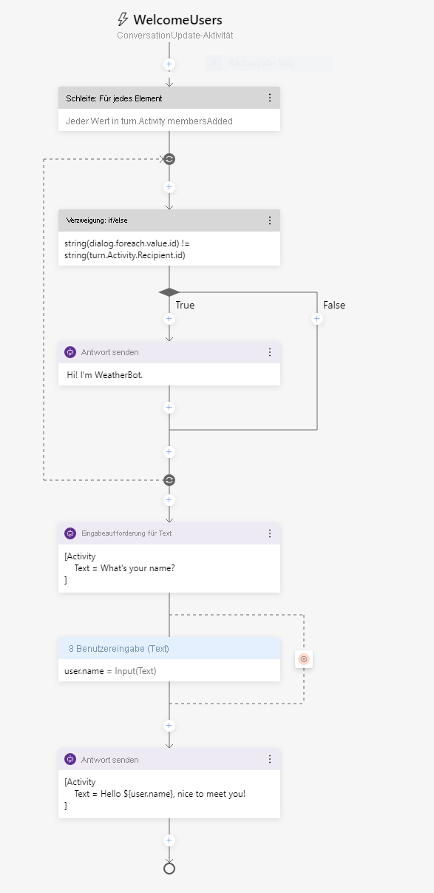
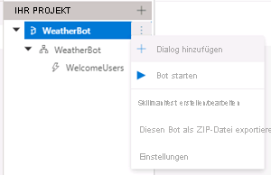
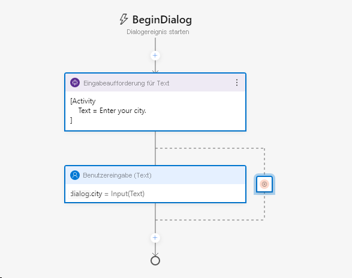
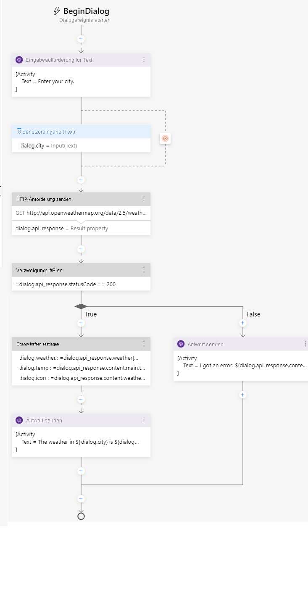
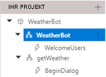
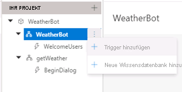
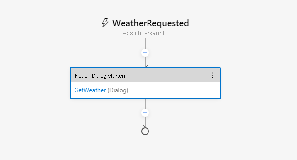
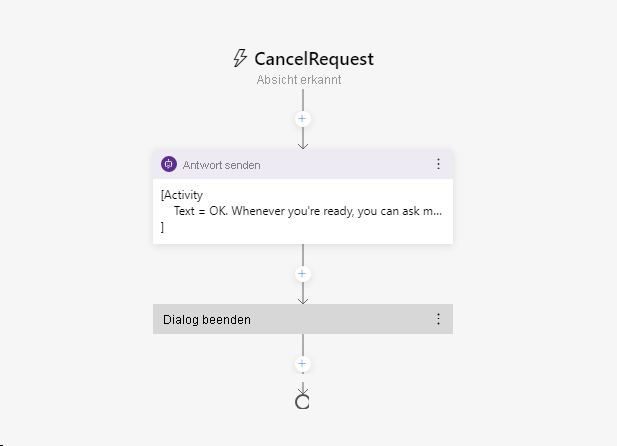

---
lab:
  title: Erstellen eines Bots mit Bot Framework Composer
  module: Module 7 - Conversational AI and the Azure Bot Service
ms.openlocfilehash: f25609df8d9abc29e691bd83d0470561c9e3e4b0
ms.sourcegitcommit: b934aa694b86756d8b297a384cc6b707f0536e57
ms.translationtype: HT
ms.contentlocale: de-DE
ms.lasthandoff: 12/08/2021
ms.locfileid: "134300686"
---
# <a name="create-a-bot-with-bot-framework-composer"></a>Erstellen eines Bots mit Bot Framework Composer

Bot Framework Composer ist ein grafischer Designer, mit dem Sie schnell, einfach und ohne Programmierkenntnisse ausgefeilte Konversationsbots erstellen können. Composer ist ein Open Source-Tool, das einen visuellen Zeichenbereich zum Entwickeln von Bots darstellt.

## <a name="prepare-to-develop-a-bot"></a>Vorbereiten der Entwicklung eines Bots

Beginnen wir mit der Vorbereitung der Dienste und Tools, die Sie für die Entwicklung eines Bots benötigen.

### <a name="get-an-openweather-api-key"></a>Abrufen eines OpenWeather-API-Schlüssels

In dieser Übung werden Sie einen Bot erstellen, der den OpenWeather-Dienst nutzt, um die Wetterbedingungen für die vom Benutzer eingegebene Stadt abzurufen. Sie benötigen einen API-Schlüssel, damit der Dienst funktioniert.

1. Wechseln Sie in einem Webbrowser zur OpenWeather-Website unter `https://openweathermap.org/price`.
2. Fordern Sie einen kostenlosen API-Schlüssel an, und erstellen Sie ein OpenWeather-Konto (falls Sie noch keins besitzen).
3. Zeigen Sie nach der Registrierung die Seite für **API-Schlüssel** an, um Ihren API-Schlüssel anzuzeigen.

### <a name="update-bot-framework-composer"></a>Aktualisieren von Bot Framework Composer

Sie verwenden Bot Framework Composer, um Ihren Bot zu erstellen. Dieses Tool wird regelmäßig aktualisiert. Stellen Sie also sicher, dass Sie die neueste Version installiert haben.

> **Hinweis**: Updates können Änderungen an der Benutzeroberfläche umfassen, die sich auf die Anweisungen in dieser Übung auswirken.

1. Starten Sie den **Bot Framework Composer**, und wenn Sie nicht automatisch zur Installation eines Updates aufgefordert werden, verwenden Sie die Option **Nach Updates suchen** im Menü **Hilfe**, um nach Updates zu suchen.
2. Wenn ein Update verfügbar ist, wählen Sie die Option, es zu installieren, wenn die Anwendung geschlossen wird. Schließen Sie dann den Bot Framework Composer, und installieren Sie das Update für den aktuell angemeldeten Benutzer. Starten Sie den Bot Framework Composer nach Abschluss der Installation neu. Die Installation kann einige Minuten dauern.
3. Stellen Sie sicher, dass die Version von Bot Framework Composer **2.0.0** oder höher ist.

## <a name="create-a-bot"></a>Erstellen eines Bots

Nun können Sie den Bot Framework Composer verwenden, um einen Bot zu erstellen.

### <a name="create-a-bot-and-customize-the-welcome-dialog-flow"></a>Erstellen eines Bots und Anpassen des Dialogflusses zur Begrüßung

1. Starten Sie den Bot Framework Composer, wenn dieser noch nicht geöffnet ist.
2. Wählen Sie auf dem **Startbildschirm** die Option **Neu** aus. Erstellen Sie dann einen neuen leeren Bot. Geben Sie ihm den Namen **WeatherBot**, und speichern Sie ihn in einem lokalen Ordner.
3. Schließen Sie den Bereich **Get Started** (Erste Schritte), falls es sich öffnet, und wählen Sie dann im Navigationsbereich auf der linken Seite die Option **Begrüßung** aus, um den Erstellungsbereich zu öffnen und die *ConversationUpdate*-Aktivität anzuzeigen, die aufgerufen wird, wenn ein Benutzer eine Konversation mit dem Bot beginnt. Die Aktivität besteht aus einem Ablauf von Aktionen.
4. Bearbeiten Sie im Eigenschaftenbereich auf der rechten Seite den Titel von **Begrüßung**, indem Sie oben im Eigenschaftenbereich auf der rechten Seite das Wort **Begrüßung** auswählen und in **WelcomeUsers** ändern.
5. Wählen Sie im Erstellungsbereich die Aktion **Antwort senden** aus. Ändern Sie dann im Eigenschaftenfenster den Standardtext von *Hi to your bot* (Hallo an Ihren Bot) in `Hi! I'm WeatherBot.`.
6. Wählen Sie im Erstellungsbereich das letzte **+** -Symbol (direkt über dem Kreis, der das <u>Ende</u> des Dialogablaufs markiert), und fügen Sie eine neue Aktion vom Typ **Ask a question** (Frage stellen) für eine Antwort vom Typ **Text** hinzu.

    Die neue Aktion erstellt zwei Knoten im Dialogablauf. Der erste Knoten definiert eine Aufforderung an den Bot, dem Benutzer eine Frage zu stellen, und der zweite Knoten stellt die Antwort dar, die der Benutzer gibt. Diese Knoten verfügen im Eigenschaftenbereich über die entsprechenden Registerkarten **Bot response** (Botantwort) und **User input** (Benutzereingabe).

7. Fügen Sie im Eigenschaftenfenster auf der Registerkarte **Bot response** (Botantwort) eine Antwort mit dem Text `What's your name?` hinzu. Legen Sie dann auf der Registerkarte für die **Benutzereingabe** den Wert von **Property** (Eigenschaft) auf `user.name` fest, um eine Variable zu definieren, auf die Sie später in der Botkonversation zugreifen können.
8. Wählen Sie im Erstellungsbereich das **+** -Symbol unter der Aktion **User input (Text)** (Benutzereingabe (Text)) aus, die Sie soeben hinzugefügt haben, und fügen Sie eine Aktion vom Typ **Send a response** (Antwort senden) hinzu.
9. Wählen Sie die neu hinzugefügte Aktion vom Typ **Send a response** (Antwort senden) aus, und legen Sie im Eigenschaftenbereich den Textwert auf `Hello ${user.name}, nice to meet you!` fest.

    Der vollständige Aktivitätsablauf sollte wie folgt aussehen:

    

### <a name="test-the-bot"></a>Testen des Bots

Damit ist der einfache Bot fertig. Nun wird er getestet.

1. Wählen Sie in der rechten oberen Ecke von Composer **Start Bot** (Bot starten) aus, und warten Sie, bis der Bot kompiliert und gestartet wurde. Dieser Vorgang kann einige Minuten in Anspruch nehmen.

    - Wenn eine Meldung der Windows-Firewall angezeigt wird, aktivieren Sie den Zugriff für alle Netzwerke.

2. Wählen Sie im Bereich **Local bot runtime manager** (Lokaler Bot-Runtime-Manager) die Option **Open Web Chat** (Webchat öffnen) aus.
3. Nach einer kurzen Pause werden im **WeatherBot**-Webchatbereich die Begrüßungsnachricht und die Aufforderung zur Eingabe des Vornamens angezeigt.  Geben Sie Ihren Vornamen ein, und drücken Sie die **EINGABETASTE**.
4. Der Bot sollte mit **Hello *your_name*, nice to meet you!** (Hallo „Ihr_Name“, schön, Sie kennenzulernen!) antworten.
5. Schließen Sie den Webchatbereich.
6. Oben rechts im Composer, neben **&#8635; Restart bot** (Bot neu starten), klicken Sie auf **<u>=</u>** , um den Bereich **Local bot runtime manager** (Lokaler Bot-Runtime-Manager) zu öffnen, und verwenden Sie das Symbol ⏹, um den Bot anzuhalten.

## <a name="add-a-dialog-to-get-the-weather"></a>Hinzufügen eines Dialogs zum Abrufen der Wetterinformationen

Nachdem Sie nun über einen funktionierenden Bot verfügen, können Sie dessen Funktionen erweitern, indem Sie Dialoge für bestimmte Interaktionen hinzufügen. In diesem Fall fügen Sie einen Dialog hinzu, der ausgelöst wird, wenn der Benutzer „Weather“ erwähnt.

### <a name="add-a-dialog"></a>Hinzufügen eines Dialogs

Zunächst müssen Sie einen Dialogablauf definieren, der zum Behandeln von Fragen zum Wetter verwendet wird.

1. Zeigen Sie in Composer mit dem Mauszeiger im Navigationsbereich auf den Knoten der obersten Ebene (**WeatherBot**), und wählen Sie im Menü **...** die Option **+ Dialog hinzufügen** aus, wie hier gezeigt:

    

    Erstellen Sie dann einen neuen Dialog namens **GetWeather** und der Beschreibung **Get the current weather condition for the provided zip code** (Abrufen der aktuellen Wetterbedingungen zur angegebenen Postleitzahl).
2. Wählen Sie im Navigationsbereich den Knoten **BeginDialog** für den neuen Dialog **GetWeather** aus. Fügen Sie dann im Erstellungsbereich mit dem Symbol **+** eine Aktion vom Typ **Ask a question** (Frage stellen) für eine Antwort vom Typ **Text** hinzu.
3. Fügen Sie im Eigenschaftenfenster auf der Registerkarte **Bot response** (Botantwort) die Antwort `Enter your city.` hinzu.
4. Legen Sie auf der Registerkarte **User input** (Benutzereingabe) das Feld **Property** (Eigenschaft) auf `dialog.city` und das Feld **Output format** (Ausgabeformat) auf den Ausdruck `=trim(this.value)` fest, um alle überflüssigen Leerzeichen um den vom Benutzer eingegebenen Wert zu entfernen.

    Der bisherige Aktivitätsablauf sollte wie folgt aussehen:

    

    Bislang fordert der Dialog den Benutzer auf, eine Stadt einzugeben. Nun müssen Sie die Logik implementieren, um die Wetterinformationen für die eingegebene Stadt abzurufen.

6. Wählen Sie im Erstellungsbereich direkt unter der Aktion **User Input** (Benutzereingabe) für den Eintrag der Stadt das Symbol **+** aus, um eine neue Aktion hinzuzufügen.
7. Wählen Sie in der Liste der Aktionen die Option **Access external resources** (Auf externe Ressourcen zugreifen) und dann **HTTP-Anforderung senden** aus.
8. Legen Sie die Eigenschaften für die **HTTP-Anforderung** wie folgt fest, wobei Sie **YOUR_API_KEY** durch Ihren [OpenWeather](https://openweathermap.org/price)-API-Schlüssel ersetzen:
    - **HTTP-Methode**: GET
    - **Url**: `http://api.openweathermap.org/data/2.5/weather?units=metric&q=${dialog.city}&appid=YOUR_API_KEY`
    - **Ergebniseigenschaft**: `dialog.api_response`

    Das Ergebnis kann eine der folgenden vier Eigenschaften aus der HTTP-Antwort enthalten:

    - **statusCode**. Zugriff über **dialog.api_response.statusCode**.
    - **reasonPhrase**. Zugriff über **dialog.api_response.reasonPhrase**.
    - **content**. Zugriff über **dialog.api_response.content**.
    - **headers**. Zugriff über **dialog.api_response.headers**.

    Wenn der Antworttyp JSON ist, wird darüber hinaus ein deserialisiertes Objekt verwendet, das über die **dialog.api_response.content**-Eigenschaft verfügbar ist. Ausführliche Informationen über die OpenWeather-API und die von ihr zurückgegebenen Antworten finden Sie in der [Dokumentation zur OpenWeather-API](https://openweathermap.org/current).

    Nun müssen Sie dem Dialogablauf, der die Antwort verarbeitet, Logik hinzufügen, die Erfolg oder Fehlschlagen der HTTP-Anforderung angeben kann.

9. Fügen Sie im Erstellungsbereich unter der von Ihnen erstellten Aktion vom Typ **Send HTTP Request** (HTTP-Anforderung senden) die Aktion **Create a condition** > **Branch: if/else** (Bedingung erstellen: Verzweigung: if/else) hinzu. Durch diese Aktion wird eine Verzweigung im Dialogablauf mit den Pfaden **True** und **False** definiert.
10. Legen Sie in den **Eigenschaften** der Verzweigungsaktion das Feld **Bedingung** auf den folgenden Ausdruck fest:

    ```
    =dialog.api_response.statusCode == 200
    ```

11. Wenn der Befehl erfolgreich ausgeführt wurde, müssen Sie die Antwort in einer Variablen speichern. Fügen Sie im Erstellungsbereich in der Verzweigung **True** eine Aktion vom Typ **Manage properties** > **Set properties** (Eigenschaften verwalten: Eigenschaften festlegen) hinzu. Fügen Sie dann im Eigenschaftenbereich die folgenden Eigenschaftenzuweisungen hinzu:

    | Eigenschaft | Wert |
    | -- | -- |
    | `dialog.weather` | `=dialog.api_response.content.weather[0].description` |
    | `dialog.temp` | `=round(dialog.api_response.content.main.temp)` |
    | `dialog.icon` | `=dialog.api_response.content.weather[0].icon` |

12. Fügen Sie im Branch **True** eine Aktion vom Typ **Send a response** (Antwort senden) unter der Aktion vom Typ **Set a property** (Eigenschaft festlegen) hinzu, und legen Sie ihren Text wie folgt fest:

    ```
    The weather in ${dialog.city} is ${dialog.weather} and the temperature is ${dialog.temp}&deg;.
    ```

    ***Hinweis**: Diese Nachricht verwendet die Eigenschaften **dialog.city**, **dialog.weather** und **dialog.temp**, die Sie in den vorherigen Aktionen festgelegt haben. Später werden Sie auch die Eigenschaft **dialog.icon** verwenden.

13. Sie müssen auch eine Antwort des Wetterdiensts berücksichtigen, die nicht 200 ist. Fügen Sie daher im Branch **False** eine Aktion vom Typ **Send a response** (Antwort senden) hinzu, und legen Sie deren Text auf `I got an error: ${dialog.api_response.content.message}.` fest.

    Der Dialogablauf sollte nun wie folgt aussehen:

    

### <a name="add-a-trigger-for-the-dialog"></a>Hinzufügen eines Triggers für den Dialog

Nun benötigen Sie eine Möglichkeit, um den neuen Dialog aus dem vorhandenen Begrüßungsdialog heraus zu initiieren.

1. Wählen Sie im Navigationsbereich den **WeatherBot**-Dialog aus, der **WelcomeUsers** enthält (dieser befindet sich unter dem Botknoten der obersten Ebene mit demselben Namen).

    

2. Legen Sie im Eigenschaftenbereich für den ausgewählten **WeatherBot**-Dialog im Abschnitt **Language Understanding** den **Erkennungsmodultyp** auf **Regular expression recognizer** (Erkennungsmodul für reguläre Ausdrücke) fest.

    > Der standardmäßige Erkennungstyp verwendet den Language Understanding-Dienst, um die Absicht des Benutzers mithilfe eines Modells zum Verstehen natürlicher Sprache zu ermitteln. Wir verwenden ein Erkennungsmodul für reguläre Ausdrücke, um diese Übung zu vereinfachen. In einer realen Anwendung sollten Sie die Verwendung von Language Understanding in Betracht ziehen, um eine anspruchsvollere Absichtserkennung zu ermöglichen.

3. Wählen Sie im Menü **...** des **WeatherBot**-Dialogs die Option **Add new Trigger** (Neuen Auslöser hinzufügen) aus.

    

    Erstellen Sie dann einen Trigger mit den folgenden Einstellungen:

    - **Wie lautet der Typ dieses Triggers?**: Absicht erkannt
    - **Wie lautet der Name dieses Triggers (RegEx)?** : `WeatherRequested`
    - **Geben Sie ein RegEx-Muster ein**: `weather`

    > Der im Textfeld für das Muster des regulären Ausdrucks eingegebene Text ist ein einfaches Muster für reguläre Ausdrücke, durch das der Bot in allen eingehenden Nachrichten nach dem Wort *weather* sucht.  Wenn „weather“ vorhanden ist, wird die Nachricht zu einer **erkannten Absicht** und der Auslöser wird ausgelöst.

4. Nachdem Sie den Trigger erstellt haben, müssen Sie eine Aktion dafür konfigurieren. Wählen Sie im Erstellungsbereich des Triggers das Symbol **+** unter Ihrem neuen Triggerknoten **WeatherRequested** aus. Wählen Sie dann in der Liste der Aktionen die Option **Dialogverwaltung** und dann **Neuen Dialog starten** aus.
5. Während die Aktion **Begin a new dialog** (Neuen Dialog starten) ausgewählt ist, wählen Sie im Eigenschaftenbereich den Dialog **GetWeather** aus der Dropdownliste **Dialogname** aus, um den zuvor definierten Dialog **GetWeather** zu starten, wenn der Trigger **WeatherRequested** erkannt wird.

    Der Aktivitätsablauf **WeatherRequested** sollte wie folgt aussehen:

    

6. Starten Sie den Bot neu, und öffnen Sie den Webchatbereich. Starten Sie dann die Konversation erneut, und geben Sie nach der Eingabe Ihres Namens `What is the weather like?` ein. Geben Sie dann, wenn Sie dazu aufgefordert werden, eine Stadt ein, z. B. `Seattle`. Der Bot kontaktiert den Dienst und sollte mit einem kurzen Wetterbericht antworten.
7. Wenn Sie den Test abgeschlossen haben, schließen Sie den Webchatbereich, und beenden Sie den Bot.

## <a name="handle-interruptions"></a>Behandeln von Unterbrechungen

Ein gut entworfener Bot sollte es Benutzern ermöglichen, den Konversationsablauf zu ändern, z. B. durch Abbrechen einer Anforderung.

1. Verwenden Sie im Bot Composer im Navigationsbereich das Menü **...** für den Dialog **WeatherBot**, um einen neuen Trigger hinzuzufügen (zusätzlich zu den bestehenden Triggern **WelcomeUsers** und **WeatherRequested**). Der neue Trigger sollte die folgenden Einstellungen aufweisen:

    - **Wie lautet der Typ dieses Triggers?**: Absicht erkannt
    - **Wie lautet der Name dieses Triggers (RegEx)?** : `CancelRequest`
    - **Geben Sie ein RegEx-Muster ein**: `cancel`

    > Der im Textfeld für das Muster des regulären Ausdrucks eingegebene Text ist ein einfaches Muster für reguläre Ausdrücke, durch das der Bot in allen eingehenden Nachrichten nach dem Wort *cancel* (Abbrechen) sucht.

2. Fügen Sie im Erstellungsbereich für den Trigger eine Aktion vom Typ **Send a response** (Antwort senden) hinzu, und legen Sie die Textantwort auf `OK. Whenever you're ready, you can ask me about the weather.` fest.
3. Fügen Sie unter der Aktion **Send a response** (Antwort senden) eine neue Aktion zum Beenden des Dialogs hinzu, indem Sie **Dialog management** (Dialogverwaltung) und **End this dialog** (Diesen Dialog beenden) auswählen.

    Der **CancelRequest**-Dialogablauf sollte wie folgt aussehen:

    

    Nachdem Sie nun über einen Trigger verfügen, der auf die Anforderung eines Benutzers zum Abbrechen reagiert, müssen Sie Unterbrechungen von Dialogabläufen zulassen, bei denen der Benutzer eine solche Anforderung stellen möchte, z. B. wenn er nach der Eingabe von Wetterinformationen zur Eingabe einer Postleitzahl aufgefordert wird.

4. Wählen Sie im Navigationsbereich **BeginDialog** unter dem Dialog **GetWeather** aus.
5. Wählen Sie die Aktion vom Typ **Prompt for text** (Aufforderung zur Texteingabe) aus, die den Benutzer auffordert, seine Stadt einzugeben.
6. Erweitern Sie in den Eigenschaften der Aktion auf der Registerkarte **Other** (Sonstiges) die Option **Prompt Configurations** (Aufforderungskonfigurationen), und legen Sie die Eigenschaft **Allow Interruptions** (Unterbrechungen zulassen) auf **true** fest.
7. Starten Sie den Bot neu und öffnen Sie den Webchatbereich. Starten Sie die Konversation neu, und geben Sie nach der Eingabe Ihres Namens `What is the weather like?` ein. Geben Sie dann, wenn Sie dazu aufgefordert werden, `cancel` ein und bestätigen Sie, dass die Anforderung abgebrochen wird.
8. Nachdem Sie die Anforderung abgebrochen haben, geben Sie `What's the weather like?` ein und beachten Sie, dass der entsprechende Trigger eine neue Instanz des Dialogs **GetWeather** startet und Sie erneut auffordert, eine Stadt einzugeben.
9. Wenn Sie den Test abgeschlossen haben, schließen Sie den Webchatbereich, und beenden Sie den Bot.

## <a name="enhance-the-user-experience"></a>Verbessern der Benutzererfahrung

Die Interaktionen mit dem Wetterbot sind bisher über Text erfolgt.  Benutzer geben Text für ihre Absichten ein, und der Bot antwortet mit Text. Obwohl Text häufig eine geeignete Möglichkeit zur Kommunikation ist, können Sie die Benutzerfreundlichkeit durch andere Formen des Benutzeroberflächenelements verbessern.  Sie können z. B. Schaltflächen verwenden, um empfohlene Aktionen auszulösen, oder eine *Karte* anzeigen, um Informationen visuell darzustellen.

### <a name="add-a-button"></a>Hinzufügen einer Schaltfläche

1. Wählen Sie im Bot Framework Composer im Navigationsbereich unter der Aktion **GetWeather** den Eintrag **BeginDialog** aus.
2. Wählen Sie im Erstellungsbereich die Aktion **Prompt for text** (Aufforderung zur Texteingabe) aus, die die Abfrage der Stadt enthält.
3. Wählen Sie im Eigenschaftenbereich die Option **Show code** (Code anzeigen) aus, und ersetzen Sie den vorhandenen Code durch den folgenden Code.

```
[Activity    
    Text = Enter your city.
    SuggestedActions = Cancel
]
```

Bei dieser Aktivität wird der Benutzer wie zuvor zur Eingabe seiner Stadt aufgefordert, es wird jedoch auch eine Schaltfläche **Cancel** (Abbrechen) angezeigt.

### <a name="add-a-card"></a>Hinzufügen einer Karte

1. Wählen Sie im Dialog **GetWeather** im **True**-Pfad nach der Überprüfung der Antwort vom HTTP-Wetterdienst die Aktion **Send a response** (Antwort senden) aus, die den Wetterbericht anzeigt.
2. Wählen Sie im Eigenschaftenbereich die Option **Show code** (Code anzeigen) aus, und ersetzen Sie den vorhandenen Code durch den folgenden Code.

```
[ThumbnailCard
    title = Weather for ${dialog.city}
    text = ${dialog.weather} (${dialog.temp}&deg;)
    image = http://openweathermap.org/img/w/${dialog.icon}.png
]
```

Diese Vorlage verwendet die gleichen Variablen wie zuvor für die Wetterbedingungen, fügt der Karte jedoch auch einen Titel hinzu, der angezeigt werden soll, sowie ein Bild für die Wetterbedingungen.

### <a name="test-the-new-user-interface"></a>Testen der neuen Benutzeroberfläche

1. Starten Sie den Bot neu und öffnen Sie den Webchatbereich. Starten Sie die Konversation neu, und geben Sie nach der Eingabe Ihres Namens `What is the weather like?` ein. Wenn Sie dazu aufgefordert werden, klicken Sie auf die Schaltfläche **Cancel** (Abbrechen), um die Anforderung abzubrechen.
2. Nach dem Abbrechen geben Sie `Tell me about the weather` ein und wenn Sie dazu aufgefordert werden, geben Sie eine Stadt ein, z. B. `London`. Der Bot wird sich mit dem Dienst in Verbindung setzen und sollte mit einer Karte antworten, auf der die Wetterbedingungen angegeben sind.
3. Wenn Sie den Test abgeschlossen haben, schließen Sie den Emulator, und beenden Sie den Bot.

## <a name="more-information"></a>Weitere Informationen

Weitere Informationen zum Bot Framework Composer finden Sie in der [Dokumentation zum Bot Framework Composer](https://docs.microsoft.com/composer/introduction).
