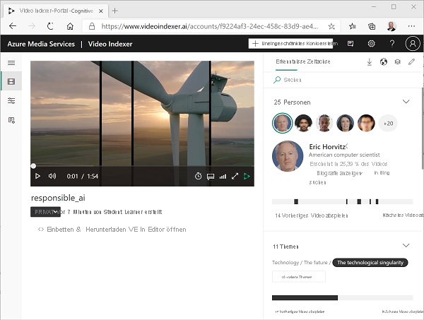
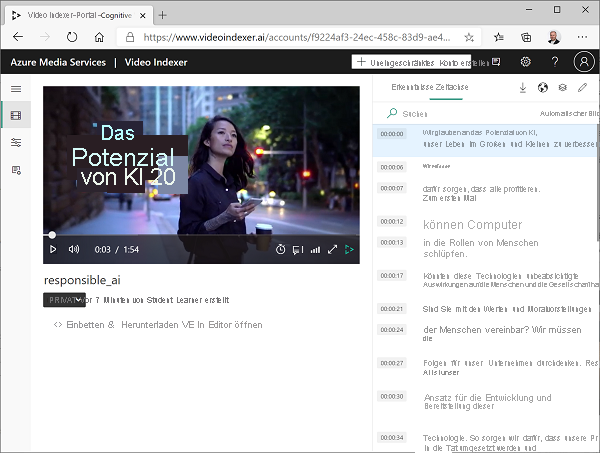
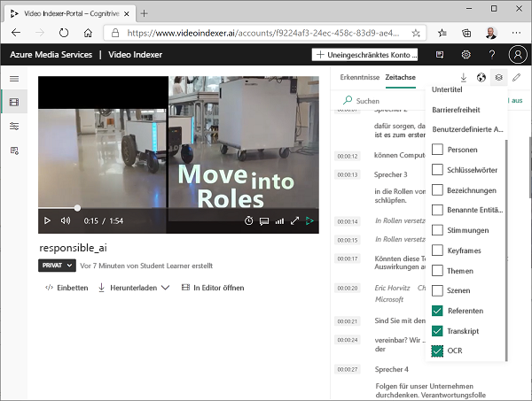
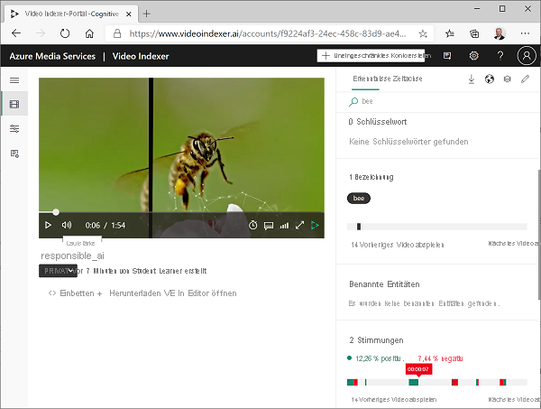
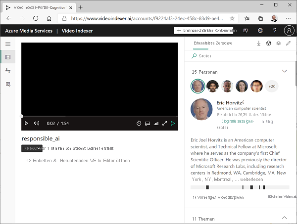
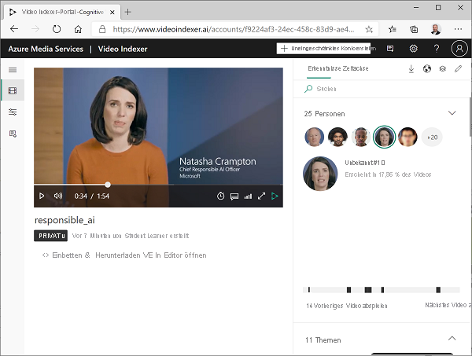
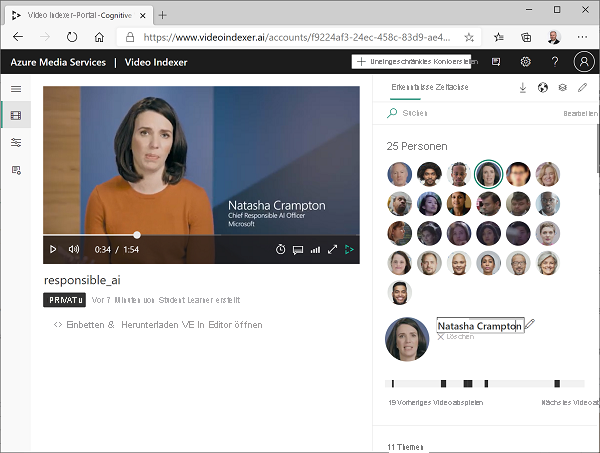
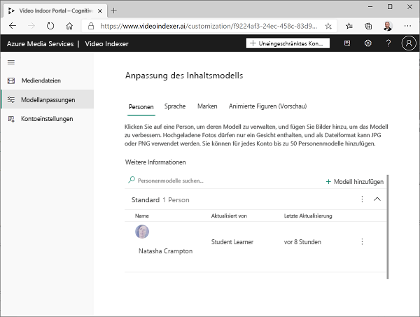
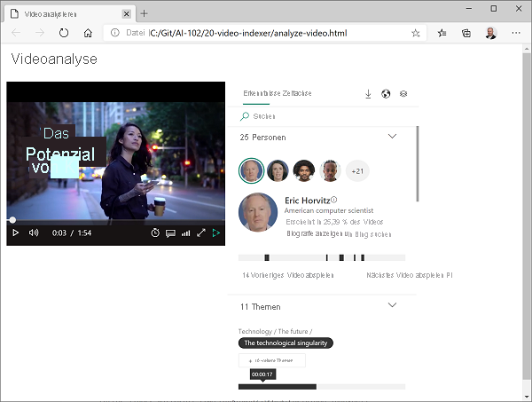

---
lab:
  title: Analysieren von Videos mit Video Analyzer
  module: Module 8 - Getting Started with Computer Vision
ms.openlocfilehash: ec23e53f363ed7c7df8fd598cfd1fc8807712f05
ms.sourcegitcommit: 7191e53bc33cda92e710d957dde4478ee2496660
ms.translationtype: HT
ms.contentlocale: de-DE
ms.lasthandoff: 07/09/2022
ms.locfileid: "147041674"
---
# Analysieren von Videos mit Video Analyzer

Ein großer Teil der heute erstellten und verbrauchten Daten liegt im Videoformat vor. **Video Analyzer for Media** ist ein KI-gestützter Dienst, mit dem Sie Videos indizieren und daraus Erkenntnisse gewinnen können.

> **Hinweis:** Ab dem 21. Juni 2022 sind die Funktionen kognitiver Dienste, die personenbezogene Informationen zurückgeben, auf Kunden beschränkt, die [eingeschränkten Zugriff](https://docs.microsoft.com/azure/cognitive-services/cognitive-services-limited-access) gewährt haben. Darüber hinaus sind Funktionen, die Rückschlüsse auf den emotionalen Zustand zulassen, nicht mehr verfügbar. Diese Einschränkungen können sich auf dieses Lab auswirken. Wir arbeiten daran, dies zu beheben, aber in der Zwischenzeit treten möglicherweise einige Fehler auf, wenn Sie die folgenden Schritte ausführen; dafür möchten wir uns entschuldigen. Weitere Informationen zu den von Microsoft vorgenommenen Änderungen und den Gründen hierfür finden Sie unter [Responsible AI investments and safeguards for facial recognition](https://azure.microsoft.com/blog/responsible-ai-investments-and-safeguards-for-facial-recognition/) (Verantwortungsvolle KI-Investitionen und Vorsichtsmaßnahmen für die Gesichtserkennung).

## Klonen des Repositorys für diesen Kurs

Wenn Sie das Coderepository **AI-102-AIEngineer** bereits in die Umgebung geklont haben, in der Sie an dieser Übung arbeiten, öffnen Sie es in Visual Studio Code. Führen Sie andernfalls die folgenden Schritte aus, um es jetzt zu klonen.

1. Starten Sie Visual Studio Code.
2. Öffnen Sie die Palette (UMSCHALT+STRG+P), und führen Sie einen **Git: Clone**-Befehl aus, um das Repository `https://github.com/MicrosoftLearning/AI-102-AIEngineer` in einen lokalen Ordner zu klonen (der Ordner ist beliebig).
3. Nachdem das Repository geklont wurde, öffnen Sie den Ordner in Visual Studio Code.
4. Warten Sie, während zusätzliche Dateien zur Unterstützung der C#-Codeprojekte im Repository installiert werden.

    > **Hinweis**: Wenn Sie aufgefordert werden, erforderliche Ressourcen zum Erstellen und Debuggen hinzuzufügen, wählen Sie **Jetzt nicht** aus.

## Hochladen eines Videos zu Video Analyzer

Zunächst müssen Sie sich beim Video Analyzer-Portal anmelden und ein Video hochladen.

> **Tipp**: Wenn die Video Analyzer-Seite in der gehosteten Laborumgebung nur langsam geladen wird, verwenden Sie Ihren lokal installierten Browser. Für die nachfolgenden Aufgaben können Sie wieder zur gehosteten VM wechseln.

1. Öffnen Sie in Ihrem Browser das Video Analyzer-Portal unter `https://www.videoindexer.ai`.
2. Wenn Sie bereits über ein Video Analyzer-Konto verfügen, melden Sie sich an. Andernfalls registrieren Sie sich für ein kostenloses Konto und melden sich mit Ihrem Microsoft-Konto (oder einer anderen gültigen Kontoart) an. Wenn Sie Probleme beim Anmelden haben, versuchen Sie, eine private Browsersitzung zu öffnen.
3. Wählen Sie in Video Analyzer die Option **Hochladen** aus. Wählen Sie dann die Option zur **Eingabe einer Datei-URL** aus, und geben Sie `https://aka.ms/responsible-ai-video` ein. Ändern Sie den Standardnamen in **Responsible AI** (Verantwortungsbewusste künstliche Intelligenz), überprüfen Sie die Standardeinstellungen, aktivieren Sie das Kontrollkästchen, um die Einhaltung der Microsoft-Richtlinien für die Gesichtserkennung zu überprüfen, und laden Sie die Datei hoch.
4. Warten Sie nach dem Hochladen der Datei einige Minuten, während Video Analyzer sie automatisch indiziert.

> **Hinweis**: In dieser Übung verwenden wir dieses Video, um die Funktionalität von Video Analyzer zu erkunden. Sie sollten sich jedoch die Zeit nehmen, es vollständig anzusehen, wenn Sie die Übung beendet haben, da es nützliche Informationen und Anleitungen für die verantwortungsvolle Entwicklung von KI-gestützten Anwendungen enthält! 

## Überprüfen von Erkenntnissen aus Videos

Der Indizierungsprozess extrahiert Erkenntnisse aus dem Video, das Sie im Portal ansehen können.

1. Wenn das Video indiziert ist, wählen Sie es im Video Analyzer-Portal aus, um es anzuzeigen. Der Videoplayer wird neben einem Bereich angezeigt, in dem die aus dem Video extrahierten Erkenntnisse angezeigt werden.

2. Wählen Sie während der Wiedergabe des Videos die Registerkarte **Zeitachse** aus, um das Transkript der Audiodaten des Videos anzuzeigen.

3. Wählen Sie oben rechts im Portal das Symbol **Ansicht** (das ähnlich aussieht wie &#128455;) aus, und wählen Sie dann in der Liste der Erkenntnisse neben **Transkript** auch **OCR** und **Sprecher** aus.

4. Beachten Sie, dass das Fenster **Zeitachse** jetzt Folgendes enthält:
    - Transkript der Audioausgabe.
    - Im Video sichtbarer Text.
    - Angaben zu den Sprechern, die in dem Video auftreten. Einige bekannte Personen werden automatisch anhand ihres Namens erkannt, andere werden durch eine Nummer angezeigt (z. B. *Speaker #1* (Sprecher Nr. 1)).
5. Wechseln Sie zurück zum Fenster **Insights** (Erkenntnisse), und sehen Sie sich die dort gezeigten Erkenntnisse an. Dazu gehören:
    - Einzelne Personen, die in dem Video vorkommen.
    - Themen, die in dem Video besprochen werden.
    - Bezeichnungen für Objekte, die in dem Video vorkommen.
    - Benannte Entitäten, z. B. Personen und Marken, die in dem Video vorkommen.
    - Wichtige Szenen.
6. Wenn der Bereich **Insights** (Erkenntnisse) angezeigt wird, wählen Sie erneut das Symbol **Ansicht** aus, und fügen Sie in der Liste der Erkenntnisse die **Schlüsselwörter** und **Stimmungen** zu dem Bereich hinzu.

    Die gefundenen Erkenntnisse können Ihnen helfen, die Hauptthemen im Video zu bestimmen. Die **Themen** für dieses Video zeigen beispielsweise, dass es eindeutig um Technologie, soziale Verantwortung und Ethik geht.

## Suchen nach Erkenntnissen

Sie können Video Analyzer verwenden, um das Video nach Erkenntnissen zu durchsuchen.

1. Geben Sie im Fenster **Insights** (Erkenntnisse) in das Feld **Suchen** den Eintrag *Bee* (Biene) ein. Möglicherweise müssen Sie im Bereich „Erkenntnisse“ nach unten scrollen, um die Ergebnisse für alle Arten von Erkenntnissen anzuzeigen.
2. Beachten Sie, dass eine übereinstimmende *Bezeichnung* gefunden wird, dessen Position im Video unten angegeben ist.
3. Wählen Sie den Anfang des Abschnitts aus, in dem eine Biene angezeigt wird, und sehen Sie sich das Video an dieser Stelle an (möglicherweise müssen Sie das Video anhalten und sorgfältig auswählen – die Biene erscheint nur kurz!)
4. Deaktivieren Sie das Feld **Suchen**, um alle Erkenntnisse für das Video anzuzeigen.

## Bearbeiten von Erkenntnissen

Sie können Video Analyzer verwenden, um die gefundenen Erkenntnisse zu bearbeiten und benutzerdefinierte Informationen hinzuzufügen, damit das Video noch sinnvoller scheint.

1. Wechseln Sie an den Anfang des Videos zurück und sehen Sie sich die **Personen** an, die oben im Fenster **Insights** (Erkenntnisse) aufgeführt sind. Beachten Sie, dass einige Personen erkannt wurden, darunter **Eric Horwitz**, ein Informatiker und Technical Fellow bei Microsoft.

2. Wählen Sie das Foto von Eric Horwitz aus, und sehen Sie sich die Informationen darunter an. Erweitern Sie den Abschnitt **Show biography** (Biografie anzeigen), um Informationen über diese Person anzuzeigen.
3. Beachten Sie, dass die Stellen im Video, an denen diese Person vorkommt, angegeben sind. Sie können sie verwenden, um diese Abschnitte des Videos anzusehen.
4. Suchen Sie im Videoplayer die Person, die bei etwa 0:34 spricht:

5. Beachten Sie, dass diese Person nicht erkannt wird und ihr ein allgemeiner Name wie **Unknown #1** (Unbekannt Nr. 1) zugewiesen wurde. Das Video enthält jedoch eine Bildunterschrift mit dem Namen dieser Person, sodass wir die Erkenntnisse anreichern können, indem wir die Details für diese Person bearbeiten.
6. Wählen Sie oben rechts im Portal das Symbol **Bearbeiten** (&#x1F589;) aus. Dann ändern Sie den Namen der unbekannten Person in **Natasha Crampton**.

7. Nachdem Sie die Namensänderung vorgenommen haben, suchen Sie im Fenster **Insights** (Erkenntnisse) nach *Natasha*. Die Ergebnisse sollten eine Person enthalten und die Abschnitte des Videos angeben, in denen sie vorkommt.
8. Erweitern Sie oben links im Portal das Menü (&#8801;) und wählen Sie die Seite **Model customizations** (Modellanpassungen) an. Dann sehen Sie auf der Registerkarte **People** (Personen), dass das Personenmodell **Default** (Standard) eine Person enthält. Video Analyzer hat die von Ihnen genannte Person zu einem Personenmodell hinzugefügt, sodass sie in allen zukünftigen Videos, die Sie in Ihrem Konto indizieren, erkannt wird.

Sie können Bilder von Personen zum Standardpersonenmodell hinzufügen oder neue eigene Modelle hinzufügen. Auf diese Weise können Sie Sammlungen von Personen mit Bildern ihrer Gesichter definieren, sodass Video Analyzer sie in Ihren Videos erkennen kann.

Beachten Sie auch, dass Sie auch benutzerdefinierte Modelle für Sprache (z. B. um branchenspezifische Terminologie festzulegen, die Video Analyzer erkennen soll) und Marken (z. B. Firmen- oder Produktnamen) erstellen können.

## Verwenden von Video Analyzer-Widgets

Das Video Analyzer-Portal ist eine nützliche Schnittstelle zum Verwalten von Projekten zur Videoindizierung. Es kann jedoch vorkommen, dass Sie das Video und seine Erkenntnisse auch Personen zugänglich machen möchten, die keinen Zugriff auf Ihr Video Analyzer-Konto haben. Video Analyzer bietet Widgets, die Sie zu diesem Zweck in eine Webseite einbetten können.

1. Öffnen Sie in Visual Studio Code im Ordner **16-video-indexer** die Datei **analyze-video.html**. Dies ist eine einfache HTML-Seite, zu der Sie die Widgets **Player** und **Insights** (Erkenntnisse) von Video Analyzer hinzufügen werden. Beachten Sie den Verweis auf das Skript **vb.widgets.mediator.js** in der Kopfzeile – dieses Skript ermöglicht es mehreren Video Analyzer-Widgets auf der Seite, miteinander zu interagieren.
2. Kehren Sie im Video Analyzer-Portal zur Seite **Media files** (Mediendateien) zurück und öffnen Sie Ihr **Responsible AI**-Video (Verantwortungsbewusste künstliche Intelligenz).
3. Wählen Sie unter dem Videoplayer **&lt;/&gt; Embed** (Einbetten) aus, um den HTML-iframe-Code zum Einbetten der Widgets anzuzeigen.
4. Wählen Sie im Dialogfeld **Share and Embed** (Freigeben und Einbetten) das Widget **Player** aus, stellen Sie die Videogröße auf 560 x 315, und kopieren Sie dann den Einbettungscode in die Zwischenablage.
5. Fügen Sie in Visual Studio Code in der Datei **analyze-video.html** den kopierten Code unter dem Kommentar **&lt;-- Player widget goes here -- &gt;** (Player-Widget hier einfügen) ein.
6. Wählen Sie im Dialogfeld **Share and Embed** (Freigeben und Einbetten) das Widget **Insights** (Erkenntnisse), und kopieren Sie dann den Einbettungscode in die Zwischenablage. Schließen Sie dann das Dialogfeld **Share and Embed** (Freigeben und Einbetten), wechseln Sie zurück zu Visual Studio Code, und fügen Sie den kopierten Code unter dem Kommentar **&lt;-- Insights widget goes here -- &gt;** (Widget für Erkenntnisse hier einfügen) ein.
7. Speichern Sie die Datei. Klicken Sie dann im **Explorer**-Bereich mit der rechten Maustaste auf **analyze-video.html**, und wählen Sie **Reveal in File Explorer** (In Datei-Explorer anzeigen) aus.
8. Öffnen Sie in Datei-Explorer **analyze-video.html** in Ihrem Browser, um die Webseite anzuzeigen.
9. Experimentieren Sie mit den Widgets und verwenden Sie das Widget **Insights** (Erkenntnisse), um nach Erkenntnissen zu suchen und im Video zu ihnen zu springen.

## Verwenden der Video Analyzer-REST-API

Video Analyzer bietet eine REST-API, mit der Sie Videos in Ihr Konto hochladen und verwalten können.

### Abrufen Ihrer API-Details

Um die Video Analyzer-API verwenden zu können, benötigen Sie einige Informationen zum Authentifizieren von Anforderungen:

1. Erweitern Sie im Video Analyzer-Portal das Menü (≡) und wählen Sie die Seite **Kontoeinstellungen**.
2. Notieren Sie sich die **Konto-ID** auf dieser Seite, da Sie sie später benötigen werden.
3. Öffnen Sie eine neue Browserregisterkarte, und wechseln Sie zum Video Analyzer-Entwicklerportal unter `https://api-portal.videoindexer.ai`, indem Sie sich mit den Zugangsdaten für Ihr Video Analyzer-Konto anmelden.
4. Zeigen Sie auf der Seite **Profil** die **Abonnements** an, die Ihrem Profil zugeordnet sind.
5. Auf der Seite mit Ihren Abonnements sehen Sie, dass Ihnen für jedes Abonnement zwei Schlüssel (primär und sekundär) zugewiesen wurden. Wählen Sie dann **Show** (Anzeigen) für einen der Schlüssel aus, um ihn anzuzeigen. Sie werden diesen Schlüssel in Kürze benötigen.

### Verwenden der REST-API

Nachdem Sie nun über die Konto-ID und einen API-Schlüssel verfügen, können Sie die REST-API verwenden, um mit Videos in Ihrem Konto zu arbeiten. In diesem Verfahren verwenden Sie ein PowerShell-Skript, um REST-Aufrufe zu tätigen. Die gleichen Prinzipien gelten jedoch auch für HTTP-Dienstprogramme wie cURL oder Postman oder jede Programmiersprache, die JSON über HTTP senden und empfangen kann.

Alle Interaktionen mit der Video Analyzer-REST-API folgen dem gleichen Muster:

- Eine erste Anforderung an die Methode **AccessToken** mit dem API-Schlüssel in der Kopfzeile wird verwendet, um ein Zugriffstoken zu erhalten.
- Nachfolgende Anforderungen verwenden das Zugriffstoken zur Authentifizierung, wenn Sie REST-Methoden zur Arbeit mit Videos aufrufen.

1. Öffnen Sie in Visual Studio Code im Ordner **16-video-indexer** die Datei **get-videos.ps1**.
2. Ersetzen Sie im PowerShell-Skript die Platzhalter **YOUR_ACCOUNT_ID** und **YOUR_API_KEY** durch die Werte für die Konto-ID und den API-Schlüssel, die Sie zuvor ermittelt haben.
3. Beachten Sie, dass der *Standort* für ein kostenloses Konto „trial“ ist. Wenn Sie ein uneingeschränktes Video Analyzer-Konto (mit einer zugehörigen Azure-Ressource) erstellt haben, können Sie dies in den Standort ändern, an dem Ihre Azure-Ressource bereitgestellt wird (z. B. „eastus“).
4. Prüfen Sie den Code im Skript und stellen Sie fest, dass zwei REST-Methoden aufgerufen werden: eine zum Abrufen eines Zugriffstokens und eine weitere zum Auflisten der Videos in Ihrem Konto.
5. Speichern Sie Ihre Änderungen und verwenden Sie dann oben rechts im Skriptbereich die Schaltfläche **&#9655;** , um das Skript auszuführen.
6. Zeigen Sie die JSON-Antwort des REST-Diensts an, die Details zu dem **Responsible AI**-Video (Verantwortungsbewusste künstliche Intelligenz) enthalten sollte, das Sie zuvor indiziert haben.

## Weitere Informationen

Weitere Informationen zu **Video Analyzer** finden Sie in der [Dokumentation zu Video Analyzer](https://docs.microsoft.com/azure/azure-video-analyzer/video-analyzer-for-media-docs/).
