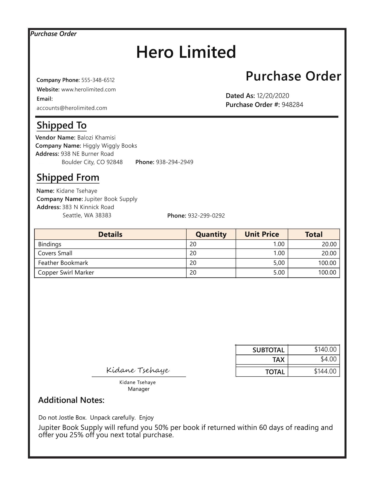
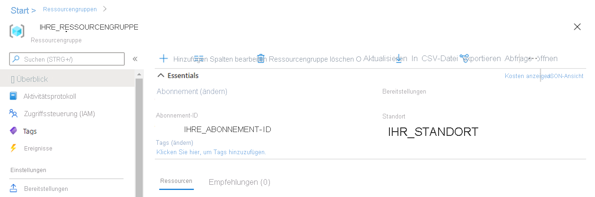

---
lab:
  title: Extrahieren von Daten aus Formularen
  module: Module 11 - Reading Text in Images and Documents
ms.openlocfilehash: 540fdc49b9efcf335d43cdd7a6db405c255cd058
ms.sourcegitcommit: de1f38bbe53ec209b42cd89516813773e2f3479b
ms.translationtype: HT
ms.contentlocale: de-DE
ms.lasthandoff: 05/17/2022
ms.locfileid: "145040701"
---
# <a name="extract-data-from-forms"></a>Extrahieren von Daten aus Formularen 

Angenommen, in einem Unternehmen müssen Mitarbeiter*innen die Daten von Bestellungen manuell in eine Datenbank eingeben. Das Unternehmen möchte KI-Dienste nutzen, um den Dateneingabeprozess zu verbessern. Sie planen, ein Machine Learning-Modell zu erstellen, das das Formular liest und strukturierte Daten erzeugt, die zum automatischen Aktualisieren einer Datenbank verwendet werden können.

**Formularerkennung** ist ein Cognitive Service, mit dem Benutzer automatisierte Datenverarbeitungssoftware erstellen können. Diese Software kann Text, Schlüssel-Wert-Paare und Tabellen mithilfe der optischen Zeichenerkennung (Optical Character Recognition, OCR) aus Formulardokumenten extrahieren. Formularerkennung enthält vorgefertigte Modelle zum Erkennen von Rechnungen, Belegen und Visitenkarten. Der Dienst bietet auch die Funktionalität zum Trainieren von benutzerdefinierten Modellen. In dieser Übung konzentrieren wir uns auf das Erstellen benutzerdefinierter Modelle.

## <a name="clone-the-repository-for-this-course"></a>Klonen des Repositorys für diesen Kurs

Wenn Sie das noch nicht erledigt haben, müssen Sie das Coderepository für diesen Kurs klonen:

1. Starten Sie Visual Studio Code.
2. Öffnen Sie die Palette (UMSCHALT+STRG+P), und führen Sie einen **Git: Clone**-Befehl aus, um das Repository `https://github.com/MicrosoftLearning/AI-102-AIEngineer` in einen lokalen Ordner zu klonen (der Ordner ist beliebig).
3. Nachdem das Repository geklont wurde, öffnen Sie den Ordner in Visual Studio Code.
4. Warten Sie, während zusätzliche Dateien zur Unterstützung der C#-Codeprojekte im Repository installiert werden.

    > **Hinweis:** Wenn Sie aufgefordert werden, erforderliche Objekte hinzuzufügen, die erstellt und debuggt werden sollen, wählen Sie **Nicht jetzt** aus.

## <a name="create-a-form-recognizer-resource"></a>Erstellen einer Formularerkennungsressource

Um den Formularerkennungsdienst nutzen zu können, müssen Sie in Ihrem Azure-Abonnement eine Formularerkennungs- oder Cognitive Services-Ressource erstellen. Über das Azure-Portal erstellen Sie eine Ressource.

1.  Öffnen Sie das Azure-Portal unter `https://portal.azure.com`, und melden Sie sich mit dem Microsoft-Konto an, das Ihrem Azure-Abonnement zugeordnet ist.

2. Wählen Sie die Schaltfläche **&#65291; Ressource erstellen** aus, suchen Sie nach *Formularerkennung*, und erstellen Sie eine **Formularerkennungsressource** mit den folgenden Einstellungen:
    - **Abonnement:** *Geben Sie Ihr Azure-Abonnement an.*
    - **Ressourcengruppe**: *Wählen Sie eine Ressourcengruppe aus, oder erstellen Sie eine (wenn Sie ein eingeschränktes Abonnement verwenden, sind Sie möglicherweise nicht berechtigt, eine neue Ressourcengruppe zu erstellen. Verwenden Sie dann die bereitgestellte Gruppe.)*
    - **Region**: *Wählen Sie eine beliebige verfügbare Region aus*.
    - **Name**: *Geben Sie einen eindeutigen Namen ein.*
    - **Tarif**: F0

    > **Hinweis**: Falls Ihr Abonnement bereits einen Formularerkennungsdienst im Tarif „F0“ enthält, wählen Sie für diesen Dienst **S0** aus.

3. Wenn die Ressource bereitgestellt wurde, wechseln Sie dorthin, und zeigen Sie ihre Seite **Schlüssel und Endpunkt** an. Sie benötigen den **Endpunkt** und einen der **Schlüssel** von dieser Seite, um später den Zugriff über Ihren Code zu verwalten. 

## <a name="gather-documents-for-training"></a>Sammeln von Dokumenten für das Training

  

Sie verwenden die Beispielformulare aus dem Ordner **21-custom-form/sample-forms** in diesem Repository, die alle erforderlichen Dateien für das Trainieren und Testen eines Modells enthalten.

1. Erweitern Sie in Visual Studio Code im Ordner **21-custom-form** den Ordner **sample-forms**. Beachten Sie, dass der Ordner Dateien enthält, deren Namen auf **.json** und **.jpg** enden.

    Sie verwenden die **JPG**-Dateien, um Ihr Modell zu trainieren.  

    Die **JSON**-Dateien wurden automatisch generiert und enthalten Bezeichnungsinformationen. Die Dateien werden zusammen mit den Formularen in Ihren Blob Storage-Container hochgeladen. 

2. Kehren Sie zum Azure-Portal unter [https://portal.azure.com](https://portal.azure.com) zurück.

3. Zeigen Sie die **Ressourcengruppe** an, in der Sie die Formularerkennungsressource erstellt haben.

4. Notieren Sie sich auf der Seite **Übersicht** für Ihre Ressourcengruppe die **Abonnement-ID** und den **Speicherort**. Sie benötigen diese Werte zusammen mit dem Namen der **Ressourcengruppe** in den nachfolgenden Schritten.



5. Klicken Sie in Visual Studio Code im Explorer-Bereich mit der rechten Maustaste auf den Ordner **21-custom-form**, und wählen Sie **In integriertem Terminal öffnen** aus.

6. Geben Sie im Terminalfenster den folgenden Befehl ein, um eine authentifizierte Verbindung mit Ihrem Azure-Abonnement herzustellen.
    
```
az login --output none
```

7. Melden Sie sich bei Ihrem Azure-Abonnement an, wenn Sie dazu aufgefordert werden. Kehren Sie dann zu Visual Studio Code zurück, und warten Sie, bis der Anmeldevorgang abgeschlossen ist.

8. Führen Sie den folgenden Befehl aus, um Azure-Speicherorte auflisten.

```
az account list-locations -o table
```

9. Suchen Sie in der Ausgabe nach dem Wert **Name**, der dem Speicherort Ihrer Ressourcengruppe entspricht (für *East US* (USA, Osten) ist der entsprechende Name beispielsweise *eastus*).

    > **Wichtig**: Zeichnen Sie den Wert **Name** auf, und verwenden Sie ihn in Schritt 12.

10. Wählen Sie im Explorer-Bereich im Ordner **21-custom-form** die Datei **setup.cmd** aus. Sie verwenden dieses Batchskript, um die Befehle der Azure-Befehlszeilenschnittstellen (CLI) auszuführen, die zum Erstellen der anderen Azure-Ressourcen erforderlich sind.

11. Überprüfen Sie im Skript **setup.cmd** die **rem**-Befehle. Diese Kommentare beschreiben das Programm, das vom Skript ausgeführt wird. Das Programm erledigt folgende Aufgaben: 
    - Erstellen eines Speicherkontos in Ihrer Azure-Ressourcengruppe
    - Hochladen von Dateien aus Ihrem lokalen Ordner _sampleforms_ in den Container _sampleforms_ im Speicherkonto
    - Drucken eines SAS-URIs (Shared Access Signature)

12. Ändern Sie die Deklarationen der Variablen **subscription_id**, **resource_group** und **location** mit den entsprechenden Werten für das Abonnement, die Ressourcengruppe und den Namen des Speicherorts, in dem Sie die Formularerkennungsressource bereitgestellt haben. **Speichern** Sie dann Ihre Änderungen.

    Behalten Sie die Variable **expiry_date** für die Übung unverändert bei. Diese Variable wird beim Generieren des SAS-URIs (Shared Access Signature) verwendet. In der Praxis sollten Sie ein geeignetes Ablaufdatum für Ihre SAS festlegen. Weitere Informationen zu SAS finden Sie [hier](https://docs.microsoft.com/azure/storage/common/storage-sas-overview#how-a-shared-access-signature-works).  

13. Geben Sie im Terminal für den Ordner **21-custom-form** den folgenden Befehl ein, um das Skript auszuführen:

```
setup
```

14. Überprüfen Sie nach Abschluss des Skripts die angezeigte Ausgabe, und notieren Sie sich den SAS-URI Ihrer Azure-Ressource.

> **Wichtig**: Fügen Sie vor Fortsetzung des Vorgangs den SAS-URI an einer Stelle ein, an der Sie ihn später erneut abrufen können (z. B. in einer neuen Textdatei in Visual Studio Code).

15. Aktualisieren Sie im Azure-Portal die Ressourcengruppe, und vergewissern Sie sich, dass sie das soeben erstellte Azure Storage-Konto enthält. Öffnen Sie das Speicherkonto, und klicken Sie im Bereich auf der linken Seite auf den **Speicherbrowser (Vorschau)** . Erweitern Sie dann im Speicherbrowser **BLOBCONTAINER**, und wählen Sie den Container **sampleforms** aus, um zu überprüfen, ob die Dateien aus Ihrem lokalen Ordner **21-custom-form/sample-forms** hochgeladen wurden.

## <a name="train-a-model-using-the-form-recognizer-sdk"></a>Trainieren eines Modells mithilfe des Formularerkennungs SDK

Jetzt trainieren Sie ein Modell mithilfe der **JPG**- und **JSON**-Dateien.

1. Öffnen Sie in Visual Studio Code im Ordner **21-custom-form/sample-forms** die Datei **fields.json**, und überprüfen Sie das darin enthaltene JSON-Dokument. Diese Datei definiert die Felder, für die Sie ein Modell zum Extrahieren aus den Formularen trainieren.
2. Öffnen Sie die Datei **Form_1.jpg.labels.json**, und überprüfen Sie den JSON-Code darin. Diese Datei identifiziert den Speicherort und die Werte für benannte Felder im Trainingsdokument **Form_1.jpg**.
3. Öffnen Sie die Datei **Form_1.jpg.ocr.json**, und überprüfen Sie den JSON-Code darin. Diese Datei enthält eine JSON-Darstellung des Textlayouts von **Form_1.jpg**, einschließlich der Position aller Textbereiche im Formular.

    *Die Dateien mit den Feldinformationen werden Ihnen in dieser Übung zur Verfügung gestellt. Für eigene Projekte können Sie diese Dateien mit [Formularerkennungsstudio](https://formrecognizer.appliedai.azure.com/studio) erstellen. Während Sie das Tool verwenden, werden Ihre Feldinformationsdateien automatisch erstellt und in Ihrem verbundenen Speicherkonto gespeichert.*

4. Erweitern Sie in Visual Studio Code im Ordner **21-custom-form** (je nach Ihrer Spracheinstellung) den Ordner **C-Sharp** oder **Python**.
5. Klicken Sie mit der rechten Maustaste auf den Ordner **test-model**, und öffnen Sie ein integriertes Terminal.

6. Installieren Sie das Formularerkennung-Paket, indem Sie den entsprechenden Befehl für Ihre bevorzugte Sprache ausführen:

**C#**

```
dotnet add package Azure.AI.FormRecognizer --version 3.0.0 
```

**Python**

```
pip install azure-ai-formrecognizer==3.0.0
```

7. Zeigen Sie den Inhalt des Ordners **train-model** an, und beachten Sie, dass er eine Datei für Konfigurationseinstellungen enthält:
    - **C#** : appsettings.json
    - **Python**: .env

8. Bearbeiten Sie die Konfigurationsdatei, und ändern Sie die Einstellungen, damit sie Folgendes wiedergeben:
    - Den **Endpunkt** für Ihre Formularerkennungsressource.
    - Einen **Schlüssel** für Ihre Formularerkennungsressource.
    - Den **SAS-URI** für Ihren Blobcontainer.

9. Beachten Sie, dass der Ordner **train-model** eine Codedatei für die Clientanwendung enthält:

    - **C#** : Program.cs
    - **Python**: train-model.py

    Öffnen Sie die Codedatei, und überprüfen Sie den darin enthaltenen Code, wobei Sie sich die folgenden Details notieren:
    - Namespaces aus dem von Ihnen installierten Paket werden importiert.
    - Die Funktion **Main** ruft die Konfigurationseinstellungen ab und verwendet den Schlüssel und Endpunkt zum Erstellen eines authentifizierten **Clients**.
    - Der Code verwendet den Trainingsclient, um ein Modell mithilfe der Bilder in Ihrem Blob Storage-Container zu trainieren, auf den mit dem von Ihnen generierten SAS-URI zugegriffen wird.

10. Öffnen Sie im Ordner **train-model** die Codedatei für die Trainingsanwendung:

    - **C#** : Program.cs
    - **Python**: train-model.py

11. Geben Sie das integrierte Terminal für den Ordner **train-model** zurück und dann den folgenden Befehl zur Ausführung des Programms ein:

**C#**

```
dotnet run
```

**Python**

```
python train-model.py
```

12. Warten Sie, bis das Programm beendet ist, und überprüfen Sie dann die Modellausgabe.
13. Notieren Sie sich die Modell-ID in der Terminalausgabe. Sie benötigen sie im nächsten Teil des Labs. 

## <a name="test-your-custom-form-recognizer-model"></a>Testen Ihres benutzerdefinierten Formularerkennungsmodells 

1. Erweitern Sie im Ordner **21-custom-form** im Unterordner für Ihre bevorzugte Sprache (**C-Sharp** oder **Python**) den Ordner **test-model**.

2. Klicken Sie mit der rechten Maustaste auf den Ordner **test-model**, und wählen Sie die Option zum **Öffnen eines integrierten Terminals** aus.

3. Installieren Sie im Terminal für den Ordner **test-model** das Formularerkennung-Paket, indem Sie den entsprechenden Befehl für Ihre Spracheinstellung ausführen:

**C#**

```
dotnet add package Azure.AI.FormRecognizer --version 3.0.0 
```

**Python**

```
pip install azure-ai-formrecognizer==3.0.0
```

*Dies ist nicht unbedingt erforderlich, wenn Sie das Paket vorher mithilfe von pip in der Python-Umgebung installiert haben, schadet aber auch nicht, um sicherzustellen, dass es tatsächlich installiert wird.*

4. Installieren Sie im gleichen Terminal für den Ordner **test-model** die Tabulate-Bibliothek. Dadurch wird Ihre Ausgabe in einer Tabelle bereitgestellt:

**C#**

```
Install-Package Tabulate.NET -Version 1.0.5
```

**Python**

```
pip install tabulate
```

5. Bearbeiten Sie im Ordner **test-model** die Konfigurationsdatei (**appsettings.json** oder **.env**, je nach Ihrer Spracheinstellung), und aktualisieren Sie sie, um die folgenden Werte hinzuzufügen:
    - Ihren Endpunkt für Formularerkennung.
    - Ihren Schlüssel für Formularerkennung.
    - Die Modell-ID, die beim Trainieren des Modells generiert wurde (Sie finden die ID, indem Sie im Terminal zurück zur Konsole **cmd** für den Ordner **train-model** wechseln). **Speichern** Sie die Änderungen.

6. Öffnen Sie im Ordner **test-model** die Codedatei für Ihre Clientanwendung (*Program.cs* für C#, *test-model.py* für Python), und überprüfen Sie den darin enthaltenen Code, wobei Sie sich die folgenden Details notieren:
    - Namespaces aus dem von Ihnen installierten Paket werden importiert.
    - Die Funktion **Main** ruft die Konfigurationseinstellungen ab und verwendet den Schlüssel und Endpunkt zum Erstellen eines authentifizierten **Clients**.
    - Anschließend werden mithilfe des Clients Formularfelder und -werte aus dem Bild **test1.jpg** extrahiert.
    

7. Geben Sie das integrierte Terminal für den Ordner **test-model** zurück und dann den folgenden Befehl zur Ausführung des Programms ein:

**C#**

```
dotnet run
```

**Python**

```
python test-model.py
```
    
8. Zeigen Sie die Ausgabe an, und beobachten Sie, wie die Ausgabe für das Modell Feldnamen wie „CompanyPhoneNumber“ und „DatedAs“ bereitstellt.   

## <a name="more-information"></a>Weitere Informationen

Weitere Informationen zum Formularerkennungsdienst finden Sie in der [Dokumentation zur Formularerkennung](https://docs.microsoft.com/azure/cognitive-services/form-recognizer/).
